Engineering\_Data\_Analysis\_Class\_Project\_(ISEN613)
================
Ridham
4/16/2021

``` r
#loading / confirming libraries
require(ISLR); 
require(tidyverse); 
require(knitr); 
require(kableExtra)
library(ISLR);
library(leaps);
library(readxl)
require(corrplot)
```

## Read data and preliminary visualization

``` r
D = read_excel("train.xlsx")
attach(D)
dim(D)
```

    ## [1] 550   9

``` r
head(D)
```

    ## # A tibble: 6 x 9
    ##      X1    X2    X3    X4    X5    X6    X7    X8    Y1
    ##   <dbl> <dbl> <dbl> <dbl> <dbl> <dbl> <dbl> <dbl> <dbl>
    ## 1  0.98  514.  294   110.     7     2     0     0  15.6
    ## 2  0.98  514.  294   110.     7     3     0     0  15.6
    ## 3  0.98  514.  294   110.     7     4     0     0  15.6
    ## 4  0.98  514.  294   110.     7     5     0     0  15.6
    ## 5  0.9   564.  318.  122.     7     2     0     0  20.8
    ## 6  0.9   564.  318.  122.     7     3     0     0  21.5

``` r
pairs(D, cex = 1.5, pch = 1) #pairs plot
```

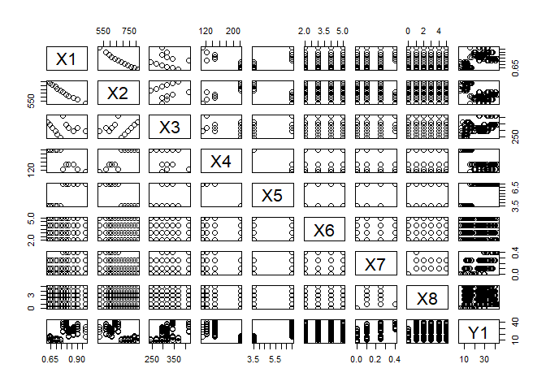<!-- -->
\#\#\# Observations: X1 and X2 seems to be collinear. X2 and X3 are
collinear and non-linear too (no specific pattern though) No specific
pattern for Y1 with any of the predictors

## Correlational plot

``` r
corr_matrix = cor(D) #Generating correlation matrix for dataframe D
corrplot.mixed(corr_matrix, lower = 'shade', upper = 'pie', order = 'hclust') #correlational plot
```

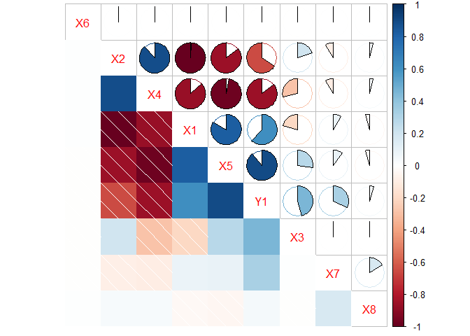<!-- -->
\#\#\# Observations: We can see strong negative correlation between
(X1,X2), (X4,X5), (X1,X4) and (X2,X5). We can see strong positive
correlation between (X2,X4) and somewhat strong correlation between
(X1,X5)

## Let’s first split the data into 70-30 Train-Test data sets.

``` r
## 70% of the sample size
smpl_size = floor(0.70 * nrow(D))

## set.seed to make the partition reproducible
set.seed(123)
train_ind = sample(seq_len(nrow(D)), size = smpl_size)

#new data
D.train = D[train_ind, ]
D.test = D[-train_ind, ]

#Dimensions of train and test (or validation) set
dim(D.train)
```

    ## [1] 385   9

``` r
dim(D.test)
```

    ## [1] 165   9

## Basic Linear Regression Models

``` r
lm1 = lm(Y1 ~ ., data=D.train) #simple linear regression with all features
summary(lm1) #
```

    ## 
    ## Call:
    ## lm(formula = Y1 ~ ., data = D.train)
    ## 
    ## Residuals:
    ##     Min      1Q  Median      3Q     Max 
    ## -9.3627 -1.3665 -0.0872  1.3015  7.6489 
    ## 
    ## Coefficients: (1 not defined because of singularities)
    ##               Estimate Std. Error t value Pr(>|t|)    
    ## (Intercept)  74.289391  27.424519   2.709  0.00706 ** 
    ## X1          -64.056092  14.844205  -4.315 2.04e-05 ***
    ## X2           -0.071992   0.024494  -2.939  0.00349 ** 
    ## X3            0.045924   0.009202   4.991 9.21e-07 ***
    ## X4                  NA         NA      NA       NA    
    ## X5            4.773927   0.475769  10.034  < 2e-16 ***
    ## X6           -0.073933   0.136685  -0.541  0.58889    
    ## X7           24.207704   1.628160  14.868  < 2e-16 ***
    ## X8            0.276736   0.097612   2.835  0.00483 ** 
    ## ---
    ## Signif. codes:  0 '***' 0.001 '**' 0.01 '*' 0.05 '.' 0.1 ' ' 1
    ## 
    ## Residual standard error: 2.977 on 377 degrees of freedom
    ## Multiple R-squared:  0.9122, Adjusted R-squared:  0.9106 
    ## F-statistic: 559.8 on 7 and 377 DF,  p-value: < 2.2e-16

## Some other models

Now, let’s try and test some observations we obtained from exploratory
data analysis. Summary of these models shows there is no significant
reduction in training error for any case. Therefore, we keep exploring
,and move to interactions between different features in the next
section.

``` r
#Remove X6
lm2 = lm(Y1~.-X6, data=D.train)
summary(lm2)
```

    ## 
    ## Call:
    ## lm(formula = Y1 ~ . - X6, data = D.train)
    ## 
    ## Residuals:
    ##     Min      1Q  Median      3Q     Max 
    ## -9.4718 -1.3344 -0.0897  1.2987  7.6870 
    ## 
    ## Coefficients: (1 not defined because of singularities)
    ##               Estimate Std. Error t value Pr(>|t|)    
    ## (Intercept)  74.517377  27.395608   2.720  0.00683 ** 
    ## X1          -64.350984  14.820303  -4.342 1.81e-05 ***
    ## X2           -0.072377   0.024461  -2.959  0.00328 ** 
    ## X3            0.046009   0.009192   5.005 8.57e-07 ***
    ## X4                  NA         NA      NA       NA    
    ## X5            4.768425   0.475215  10.034  < 2e-16 ***
    ## X7           24.189295   1.626280  14.874  < 2e-16 ***
    ## X8            0.277757   0.097502   2.849  0.00463 ** 
    ## ---
    ## Signif. codes:  0 '***' 0.001 '**' 0.01 '*' 0.05 '.' 0.1 ' ' 1
    ## 
    ## Residual standard error: 2.974 on 378 degrees of freedom
    ## Multiple R-squared:  0.9122, Adjusted R-squared:  0.9108 
    ## F-statistic: 654.3 on 6 and 378 DF,  p-value: < 2.2e-16

``` r
#Remove X4 and X6
lm3 = lm(Y1~.-X4-X6, data=D.train)
summary(lm3)
```

    ## 
    ## Call:
    ## lm(formula = Y1 ~ . - X4 - X6, data = D.train)
    ## 
    ## Residuals:
    ##     Min      1Q  Median      3Q     Max 
    ## -9.4718 -1.3344 -0.0897  1.2987  7.6870 
    ## 
    ## Coefficients:
    ##               Estimate Std. Error t value Pr(>|t|)    
    ## (Intercept)  74.517377  27.395608   2.720  0.00683 ** 
    ## X1          -64.350984  14.820303  -4.342 1.81e-05 ***
    ## X2           -0.072377   0.024461  -2.959  0.00328 ** 
    ## X3            0.046009   0.009192   5.005 8.57e-07 ***
    ## X5            4.768425   0.475215  10.034  < 2e-16 ***
    ## X7           24.189295   1.626280  14.874  < 2e-16 ***
    ## X8            0.277757   0.097502   2.849  0.00463 ** 
    ## ---
    ## Signif. codes:  0 '***' 0.001 '**' 0.01 '*' 0.05 '.' 0.1 ' ' 1
    ## 
    ## Residual standard error: 2.974 on 378 degrees of freedom
    ## Multiple R-squared:  0.9122, Adjusted R-squared:  0.9108 
    ## F-statistic: 654.3 on 6 and 378 DF,  p-value: < 2.2e-16

``` r
#Remove X1, X4, X6
lm4 = lm(Y1~.-X6-X1-X4, data=D.train)
summary(lm4)
```

    ## 
    ## Call:
    ## lm(formula = Y1 ~ . - X6 - X1 - X4, data = D.train)
    ## 
    ## Residuals:
    ##     Min      1Q  Median      3Q     Max 
    ## -9.4014 -1.5134 -0.0186  1.5634  7.7556 
    ## 
    ## Coefficients:
    ##               Estimate Std. Error t value Pr(>|t|)    
    ## (Intercept) -42.710375   4.758528  -8.976  < 2e-16 ***
    ## X2            0.029196   0.007317   3.990 7.93e-05 ***
    ## X3            0.024071   0.007858   3.063  0.00235 ** 
    ## X5            6.077546   0.375880  16.169  < 2e-16 ***
    ## X7           24.090891   1.663982  14.478  < 2e-16 ***
    ## X8            0.268901   0.099750   2.696  0.00734 ** 
    ## ---
    ## Signif. codes:  0 '***' 0.001 '**' 0.01 '*' 0.05 '.' 0.1 ' ' 1
    ## 
    ## Residual standard error: 3.043 on 379 degrees of freedom
    ## Multiple R-squared:  0.9078, Adjusted R-squared:  0.9066 
    ## F-statistic: 746.3 on 5 and 379 DF,  p-value: < 2.2e-16

``` r
#Remove X2, X4, X6
lm5 = lm(Y1~.-X6-X2-X4, data=D.train)
summary(lm5)
```

    ## 
    ## Call:
    ## lm(formula = Y1 ~ . - X6 - X2 - X4, data = D.train)
    ## 
    ## Residuals:
    ##     Min      1Q  Median      3Q     Max 
    ## -9.6076 -1.4946 -0.0269  1.3952  7.5442 
    ## 
    ## Coefficients:
    ##               Estimate Std. Error t value Pr(>|t|)    
    ## (Intercept)  -5.772513   3.804446  -1.517  0.13002    
    ## X1          -22.415471   4.376533  -5.122 4.83e-07 ***
    ## X3            0.025857   0.006236   4.146 4.17e-05 ***
    ## X5            5.929324   0.270857  21.891  < 2e-16 ***
    ## X7           24.151620   1.642783  14.702  < 2e-16 ***
    ## X8            0.267072   0.098427   2.713  0.00696 ** 
    ## ---
    ## Signif. codes:  0 '***' 0.001 '**' 0.01 '*' 0.05 '.' 0.1 ' ' 1
    ## 
    ## Residual standard error: 3.004 on 379 degrees of freedom
    ## Multiple R-squared:  0.9101, Adjusted R-squared:  0.909 
    ## F-statistic: 767.7 on 5 and 379 DF,  p-value: < 2.2e-16

``` r
#Diagnostic plots
plot(lm3, which=1)
```

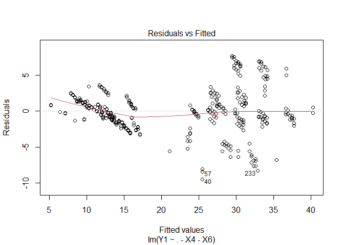<!-- -->

``` r
plot(lm3, which=3)
```

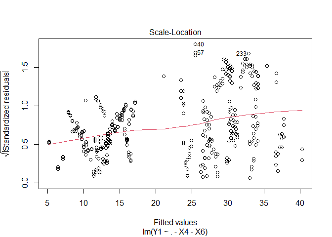<!-- -->

``` r
plot(lm3, which=5)
```

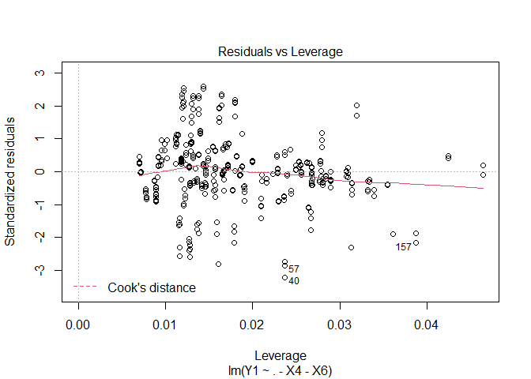<!-- -->

## Some more linear models with interactions between features

We tried many different permutations with different interactions and
finally came us with 15 interaction terms. while testing it using test
data, error was significantly lower than simple linear regression
models. But, this type of models are not easy to interpret and
understand the predictions. As our goal of the project was to provide
best predictions, we didn’t rule out the model.

``` r
library(caret)
```

    ## Loading required package: lattice

    ## 
    ## Attaching package: 'caret'

    ## The following object is masked from 'package:purrr':
    ## 
    ##     lift

``` r
train.control <- trainControl(method = "cv", number = 10)

# Train the model
lm1 = train(Y1~X1+X2+X3+X5+X7+X8, data=D.train, method = "lm", trControl = train.control)
#print
print(lm3)
```

    ## 
    ## Call:
    ## lm(formula = Y1 ~ . - X4 - X6, data = D.train)
    ## 
    ## Coefficients:
    ## (Intercept)           X1           X2           X3           X5           X7  
    ##    74.51738    -64.35098     -0.07238      0.04601      4.76842     24.18929  
    ##          X8  
    ##     0.27776

``` r
##interactions
train.control <- trainControl(method = "cv", number = 10)

lm15 = train(Y1~X1+X2+X3+X5+X7+X8+X1*X2+X2*X3+X1*X3+X5*X7+X1*X5+X2*X5+X3*X5+X1*X7+X2*X7+X3*X7+X1*X8+X2*X8+X3*X8+X5*X8+X7*X8, data=D.train, method = "lm", trControl = train.control)
```

    ## Warning in predict.lm(modelFit, newdata): prediction from a rank-deficient fit
    ## may be misleading

    ## Warning in predict.lm(modelFit, newdata): prediction from a rank-deficient fit
    ## may be misleading

    ## Warning in predict.lm(modelFit, newdata): prediction from a rank-deficient fit
    ## may be misleading

    ## Warning in predict.lm(modelFit, newdata): prediction from a rank-deficient fit
    ## may be misleading

    ## Warning in predict.lm(modelFit, newdata): prediction from a rank-deficient fit
    ## may be misleading

    ## Warning in predict.lm(modelFit, newdata): prediction from a rank-deficient fit
    ## may be misleading

    ## Warning in predict.lm(modelFit, newdata): prediction from a rank-deficient fit
    ## may be misleading

    ## Warning in predict.lm(modelFit, newdata): prediction from a rank-deficient fit
    ## may be misleading

    ## Warning in predict.lm(modelFit, newdata): prediction from a rank-deficient fit
    ## may be misleading

    ## Warning in predict.lm(modelFit, newdata): prediction from a rank-deficient fit
    ## may be misleading

``` r
print(lm15)
```

    ## Linear Regression 
    ## 
    ## 385 samples
    ##   6 predictor
    ## 
    ## No pre-processing
    ## Resampling: Cross-Validated (10 fold) 
    ## Summary of sample sizes: 346, 346, 347, 346, 346, 347, ... 
    ## Resampling results:
    ## 
    ##   RMSE      Rsquared   MAE    
    ##   1.438567  0.9798898  1.16445
    ## 
    ## Tuning parameter 'intercept' was held constant at a value of TRUE

``` r
int.pred = predict(lm15, newdata = D.test)
```

    ## Warning in predict.lm(modelFit, newdata): prediction from a rank-deficient fit
    ## may be misleading

``` r
error.int = mean((int.pred - D.test$Y1)^2)
error.int
```

    ## [1] 1.962741

After tyring and testing enough number of regression models, we decided
to go with a systematic approach to deal with importance of different
features.

## Best subset selection

``` r
bss = regsubsets(Y1~.,D, nvmax = length(names(D)))
```

    ## Warning in leaps.setup(x, y, wt = wt, nbest = nbest, nvmax = nvmax, force.in =
    ## force.in, : 1 linear dependencies found

    ## Reordering variables and trying again:

``` r
smry = summary(bss)
names(smry)
```

    ## [1] "which"  "rsq"    "rss"    "adjr2"  "cp"     "bic"    "outmat" "obj"

``` r
smry
```

    ## Subset selection object
    ## Call: regsubsets.formula(Y1 ~ ., D, nvmax = length(names(D)))
    ## 8 Variables  (and intercept)
    ##    Forced in Forced out
    ## X1     FALSE      FALSE
    ## X2     FALSE      FALSE
    ## X3     FALSE      FALSE
    ## X5     FALSE      FALSE
    ## X6     FALSE      FALSE
    ## X7     FALSE      FALSE
    ## X8     FALSE      FALSE
    ## X4     FALSE      FALSE
    ## 1 subsets of each size up to 7
    ## Selection Algorithm: exhaustive
    ##          X1  X2  X3  X4  X5  X6  X7  X8 
    ## 1  ( 1 ) " " " " " " " " "*" " " " " " "
    ## 2  ( 1 ) " " " " " " " " "*" " " "*" " "
    ## 3  ( 1 ) " " " " "*" " " "*" " " "*" " "
    ## 4  ( 1 ) "*" " " " " "*" "*" " " "*" " "
    ## 5  ( 1 ) "*" " " " " "*" "*" " " "*" "*"
    ## 6  ( 1 ) "*" "*" "*" " " "*" " " "*" "*"
    ## 7  ( 1 ) "*" "*" "*" " " "*" "*" "*" "*"

``` r
plot(smry$adjr2 ,xlab =" Number of Variables ", ylab=" Adjusted R.Sq.",type="l")
num1 = which.max(smry$adjr2)
num1 #number of predictors
```

    ## [1] 6

``` r
points (num1, smry$adjr2[num1], col ="blue",cex =2, pch =20)
```

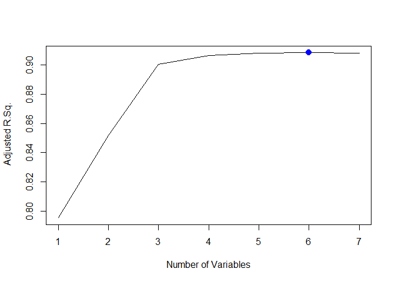<!-- -->

``` r
plot(smry$bic ,xlab =" Number of Variables ", ylab="bic",type="l")
num1 = which.min(smry$bic)
num1 #number of predictors
```

    ## [1] 5

``` r
points (num1, smry$bic[num1], col ="blue",cex =2, pch =20)
```

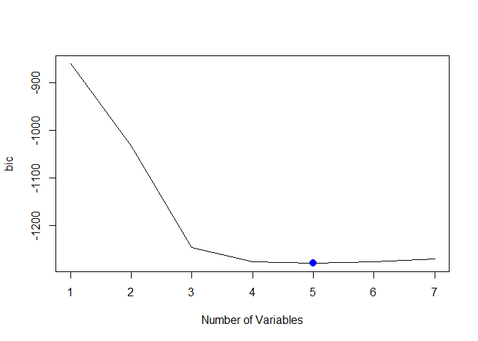<!-- -->

``` r
plot(smry$cp ,xlab =" Number of Variables ", ylab=" cp",type="l")
num1 = which.min(smry$cp)
num1 #number of predictors
```

    ## [1] 6

``` r
points (num1, smry$cp[num1], col ="blue",cex =2, pch =20)
```

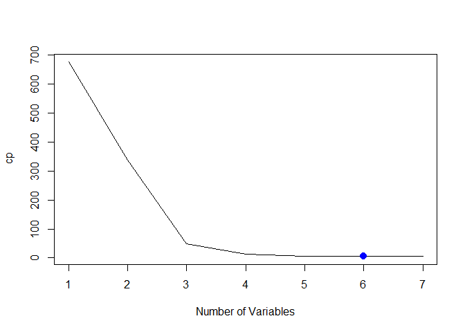<!-- -->

## Working on results of best subset selection

``` r
# Define training control
train.control <- trainControl(method = "cv", number = 10)
# Train the model
lm10 = train(Y1~X1+X4+X5+X7+X8, data=D.train, method = "lm", trControl = train.control)
# Summarize the results
print(lm10)
```

    ## Linear Regression 
    ## 
    ## 385 samples
    ##   5 predictor
    ## 
    ## No pre-processing
    ## Resampling: Cross-Validated (10 fold) 
    ## Summary of sample sizes: 346, 349, 346, 347, 346, 347, ... 
    ## Resampling results:
    ## 
    ##   RMSE      Rsquared   MAE     
    ##   2.981163  0.9144768  2.140292
    ## 
    ## Tuning parameter 'intercept' was held constant at a value of TRUE

``` r
# Define training control
train.control <- trainControl(method = "cv", number = 10)
# Train the model
lm11 = train(Y1~X1+X2+X3+X5+X7+X8, data=D.train, method = "lm", trControl = train.control)
# Summarize the results
print(lm11)
```

    ## Linear Regression 
    ## 
    ## 385 samples
    ##   6 predictor
    ## 
    ## No pre-processing
    ## Resampling: Cross-Validated (10 fold) 
    ## Summary of sample sizes: 345, 348, 347, 345, 347, 347, ... 
    ## Resampling results:
    ## 
    ##   RMSE      Rsquared   MAE     
    ##   2.949742  0.9132887  2.140036
    ## 
    ## Tuning parameter 'intercept' was held constant at a value of TRUE

``` r
bss.pred = predict(lm11, newdata = D.test)
error.bss = mean((bss.pred - D.test$Y1)^2) #error of best subset selection regression
error.bss
```

    ## [1] 9.236923

## Creating model matrix

``` r
#install.packages("glmnet")
#creatig model matrix which is required for Ridge Regression
x = model.matrix(Y1~.,D.train)[,-1] 
y = D.train$Y1

x.test = model.matrix(Y1~.,D.test)[,-1]
y.test = D.test$Y1  
```

# Regularization

## Ridge Regression

``` r
library(glmnet)
```

    ## Loading required package: Matrix

    ## 
    ## Attaching package: 'Matrix'

    ## The following objects are masked from 'package:tidyr':
    ## 
    ##     expand, pack, unpack

    ## Loaded glmnet 4.1-1

``` r
grid = 10^seq(10,-2, length =100)
ridreg = glmnet(x,y,alpha =0, lambda =grid)
```

## Cross-Validation for best lambda Ridge

``` r
set.seed (123)
cvrid = cv.glmnet(x,y,alpha=0)
plot(cvrid)
```

<!-- -->

``` r
bestlamrid = cvrid$lambda.min
bestlamrid
```

    ## [1] 0.8876817

``` r
cvrid
```

    ## 
    ## Call:  cv.glmnet(x = x, y = y, alpha = 0) 
    ## 
    ## Measure: Mean-Squared Error 
    ## 
    ##     Lambda Index Measure    SE Nonzero
    ## min 0.8877   100   11.16 1.698       8
    ## 1se 2.0507    91   12.74 2.038       8

``` r
#Coefficients
ridout = glmnet(x,y,alpha=0)
predict(ridout, type="coefficients", s=bestlamrid)
```

    ## 9 x 1 sparse Matrix of class "dgCMatrix"
    ##                       1
    ## (Intercept)  6.45739029
    ## X1          -7.01268409
    ## X2          -0.01204808
    ## X3           0.05217989
    ## X4          -0.04751133
    ## X5           3.00263570
    ## X6          -0.07886213
    ## X7          22.17903376
    ## X8           0.29909906

``` r
rid.pred = predict(ridreg, s=bestlamrid, newx=x.test)
error.ridge = mean((rid.pred - y.test)^2)
error.ridge
```

    ## [1] 9.637069

## Lasso Regression

``` r
grid = 10^seq(10,-2, length =100)
Lassoreg = glmnet(x,y,alpha =1, lambda =grid)
```

## Cross-Validation for best lambda Lasso

``` r
set.seed (123)
cvlas = cv.glmnet(x,y,alpha=1)
plot(cvlas)
```

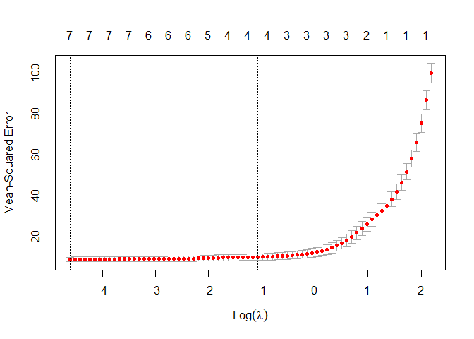<!-- -->

``` r
bestlamlas = cvlas$lambda.min
bestlamlas
```

    ## [1] 0.009971542

``` r
cvlas
```

    ## 
    ## Call:  cv.glmnet(x = x, y = y, alpha = 1) 
    ## 
    ## Measure: Mean-Squared Error 
    ## 
    ##     Lambda Index Measure    SE Nonzero
    ## min 0.0100    74   9.136 1.174       7
    ## 1se 0.3421    36  10.290 1.581       4

``` r
#Coefficients
lasout = glmnet(x,y,alpha=1)
predict(lasout, type="coefficients", s=bestlamlas)
```

    ## 9 x 1 sparse Matrix of class "dgCMatrix"
    ##                         1
    ## (Intercept)  3.585888e+01
    ## X1          -4.301153e+01
    ## X2          -1.137366e-05
    ## X3           .           
    ## X4          -7.707256e-02
    ## X5           5.207663e+00
    ## X6          -7.135895e-02
    ## X7           2.409183e+01
    ## X8           2.681632e-01

``` r
las.pred.tr = predict(Lassoreg, s=bestlamlas, newx=x)
error.lasso.tr = mean((las.pred.tr - y)^2)
error.lasso.tr
```

    ## [1] 8.724546

``` r
las.pred = predict(Lassoreg, s=bestlamlas, newx=x.test)
error.lasso = mean((las.pred - y.test)^2)
error.lasso
```

    ## [1] 9.310994

# Trees

## Simple tree

``` r
library(tree)
```

    ## Registered S3 method overwritten by 'tree':
    ##   method     from
    ##   print.tree cli

``` r
regtree = tree(Y1~.,D.train)
summary(regtree)
```

    ## 
    ## Regression tree:
    ## tree(formula = Y1 ~ ., data = D.train)
    ## Variables actually used in tree construction:
    ## [1] "X4" "X1" "X7" "X8"
    ## Number of terminal nodes:  7 
    ## Residual mean deviance:  5.207 = 1968 / 378 
    ## Distribution of residuals:
    ##     Min.  1st Qu.   Median     Mean  3rd Qu.     Max. 
    ## -9.74400 -1.28400  0.06647  0.00000  1.49600  7.62600

``` r
plot(regtree, type = "uniform") #display tree structure
text(regtree,pretty=0)
```

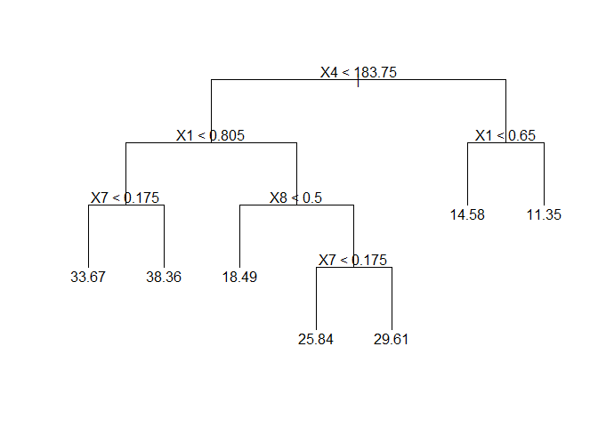<!-- -->

``` r
#Prediction
tree.pred = predict(regtree,D.test)
MSE = mean((D.test$Y1 - tree.pred)^2)
MSE
```

    ## [1] 5.658692

## Tree Pruning

Tree pruning does not improve the model in this case because, pruning
does not result any lesser number of leaf-nodes.

``` r
set.seed(123)

#10 fold Cross validation for tree pruning 
cv.D = cv.tree(regtree, K = 10)

#plotting data
plot(cv.D$size ,cv.D$dev, type="b")
```

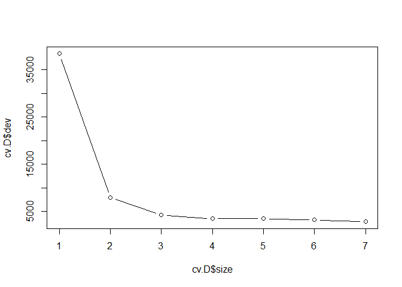<!-- -->

``` r
b = cv.D$size[which.min(cv.D$dev)]
b
```

    ## [1] 7

``` r
#pruned tree
prune.D = prune.tree(regtree ,best = b)

#plotting the pruned tree
plot(prune.D,type = "uniform")
text(prune.D ,pretty =0)
```

<!-- -->

``` r
#size of pruned tree
summary(prune.D)$size
```

    ## [1] 7

``` r
#prediction
prune.pred=predict(prune.D,D.test)

#test MSE
MSE_prune = mean((D.test$Y1 - prune.pred)^2)
MSE_prune
```

    ## [1] 5.658692

\#Bagging

5-fold cross-validation for bagging using caret library.

``` r
library(caret)
set.seed(23)
cntrl <- trainControl(method = "cv", number = 5)
bagmodel = train(Y1 ~ ., data = D.train, method = "treebag",
        trControl = cntrl)
bag.pred = predict(bagmodel,D.test)
test_MSE_bag = mean((D.test$Y1 - bag.pred)^2)
test_MSE_bag
```

    ## [1] 5.192825

## Random Forest

``` r
library(randomForest)
```

    ## randomForest 4.6-14

    ## Type rfNews() to see new features/changes/bug fixes.

    ## 
    ## Attaching package: 'randomForest'

    ## The following object is masked from 'package:dplyr':
    ## 
    ##     combine

    ## The following object is masked from 'package:ggplot2':
    ## 
    ##     margin

``` r
set.seed(1)


bag.D = randomForest(Y1~.,data=D.train, mtry=5, importance =TRUE, ntree=500)
bag.D
```

    ## 
    ## Call:
    ##  randomForest(formula = Y1 ~ ., data = D.train, mtry = 5, importance = TRUE,      ntree = 500) 
    ##                Type of random forest: regression
    ##                      Number of trees: 500
    ## No. of variables tried at each split: 5
    ## 
    ##           Mean of squared residuals: 0.4017243
    ##                     % Var explained: 99.59

``` r
#prediction
bag.pred = predict(bag.D,D.test)

#test MSE
MSE_bag = mean((D.test$Y1 - bag.pred)^2)
MSE_bag
```

    ## [1] 0.3719386

# Boosting:

First, we tried some random approached. for example, first we fixed
n.trees to 5850 and generated different models with different
interaction depths.

## Boosting: Manually tuning interaction depth while keeping other arguments constant.

``` r
library(gbm)
```

    ## Loaded gbm 2.1.8

``` r
set.seed(123)
try = seq(1,20, by = 1)
count = 1
MSE_boost = c()

for (i in try){
  boost.D = gbm(Y1~.,data=D.train,
  distribution = "gaussian",n.trees=5850,  shrinkage = 0.1, interaction.depth = i, n.minobsinnode = 5, bag.fraction = 0.7)
  pred.boost = predict(boost.D,newdata=D.test)
  MSE_boost[count] = mean((pred.boost-D.test$Y1)^2)
  count = count + 1
}
```

    ## Using 5850 trees...

    ## Using 5850 trees...
    ## 
    ## Using 5850 trees...
    ## 
    ## Using 5850 trees...
    ## 
    ## Using 5850 trees...
    ## 
    ## Using 5850 trees...
    ## 
    ## Using 5850 trees...
    ## 
    ## Using 5850 trees...
    ## 
    ## Using 5850 trees...
    ## 
    ## Using 5850 trees...
    ## 
    ## Using 5850 trees...
    ## 
    ## Using 5850 trees...
    ## 
    ## Using 5850 trees...
    ## 
    ## Using 5850 trees...
    ## 
    ## Using 5850 trees...
    ## 
    ## Using 5850 trees...
    ## 
    ## Using 5850 trees...
    ## 
    ## Using 5850 trees...
    ## 
    ## Using 5850 trees...
    ## 
    ## Using 5850 trees...

``` r
## Miracles
try[which.min(MSE_boost)]
```

    ## [1] 4

``` r
min(MSE_boost)
```

    ## [1] 0.1381424

``` r
plot(try,MSE_boost, cex = 1, type = "o", col = "blue", main = "interaction depth v/s MSE", xlab = "xlabel", ylab = "ylabel", pch = 20)
```

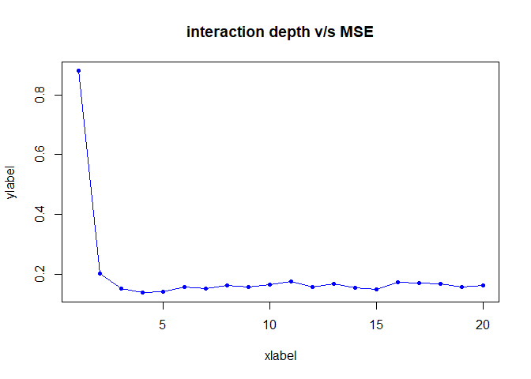<!-- -->

``` r
MSE_boost
```

    ##  [1] 0.8799780 0.2015867 0.1513424 0.1381424 0.1405389 0.1563016 0.1526091
    ##  [8] 0.1625478 0.1584883 0.1645559 0.1761444 0.1567086 0.1672345 0.1551077
    ## [15] 0.1504693 0.1721107 0.1698634 0.1685360 0.1587955 0.1637299

## Support Vector Machines

Gives mediocre results on test data.

``` r
#Install Package
# install.packages("e1071")

#Load Library
library(e1071)
 
#Regression with SVM
modelsvm = svm(Y1~.,D.train, kernel = "linear")

#Predict using SVM regression
predYsvm = predict(modelsvm, D.test)
mean((predYsvm-D.test$Y1)^2)
```

    ## [1] 8.941498
