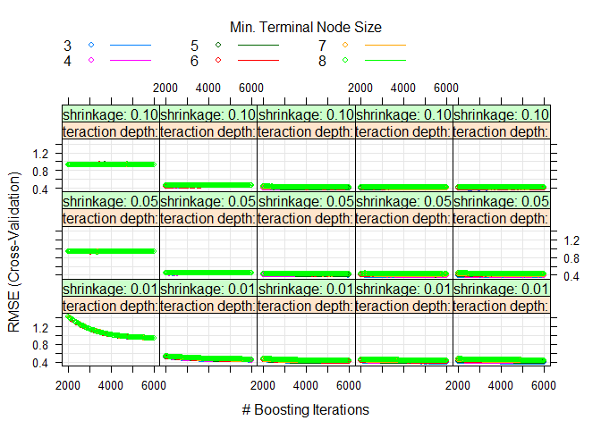

Final Model: Boosted Tree
================
Ridham
8/8/2021

``` r
#loading / confirming libraries
require(ISLR)
require(tidyverse)
require(knitr)
require(kableExtra)
library(ISLR)
library(leaps)
library(readxl)
require(corrplot)
library(caret)
```

## Read data and preliminary visualization

``` r
D = read_excel("train.xlsx")
test = read_excel("test.xlsx")
attach(D)
```

## Let’s first split the data into 70-30 Train-Test data sets.

``` r
## 70% of the sample size
smpl_size = floor(0.70 * nrow(D))

## set.seed to make the partition reproducible
set.seed(123)
train_ind = sample(seq_len(nrow(D)), size = smpl_size)

#new data
D.train = D[train_ind, ]
D.test = D[-train_ind, ]

#Dimensions of train and test (or validation) set
dim(D.train)
```

    ## [1] 385   9

``` r
dim(D.test)
```

    ## [1] 165   9

## We used Caret to simultaneously tune n.tree, intraction.depth, n.minobsinnode ,and bag.fraction.

``` r
set.seed(23)
gbm_grid =  expand.grid(interaction.depth = 1:5,
                        n.trees = seq(2000, 6000, by=50),
                        shrinkage = c(0.01, 0.1, 0.05),
                        n.minobsinnode = 3:8)

cv_5 = trainControl(method = "cv", number = 5)

seat_gbm_tune = train(Y1 ~ ., data = D,
                      method = "gbm",
                      trControl = cv_5,
                      verbose = FALSE,
                      tuneGrid = gbm_grid)

plot(seat_gbm_tune)
```

<!-- -->

``` r
seat_gbm_tune$bestTune
```

    ##      n.trees interaction.depth shrinkage n.minobsinnode
    ## 3910    3050                 4      0.05              3

``` r
mean((predict(seat_gbm_tune,newdata=test)-test$Y1)^2)
```

    ## [1] 0.4698243
